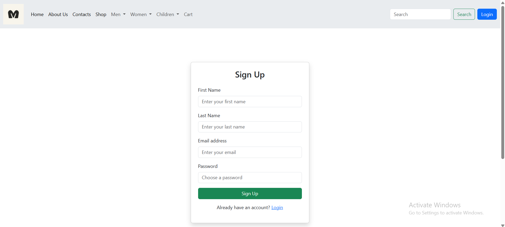
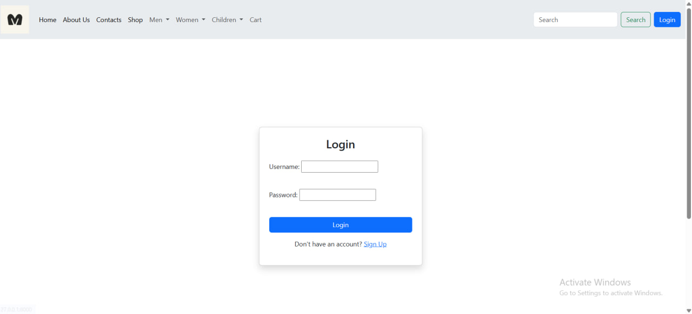
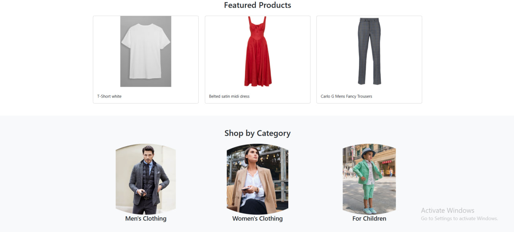
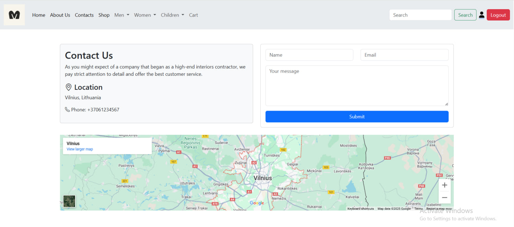
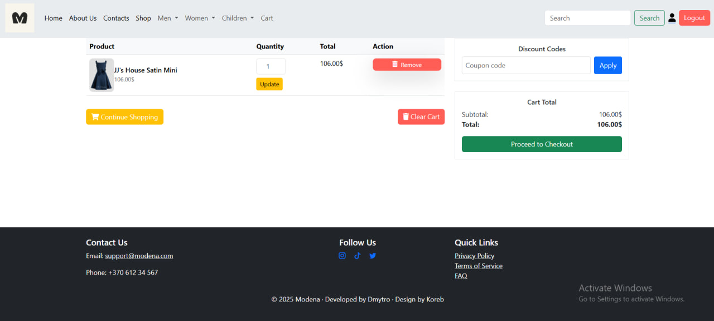
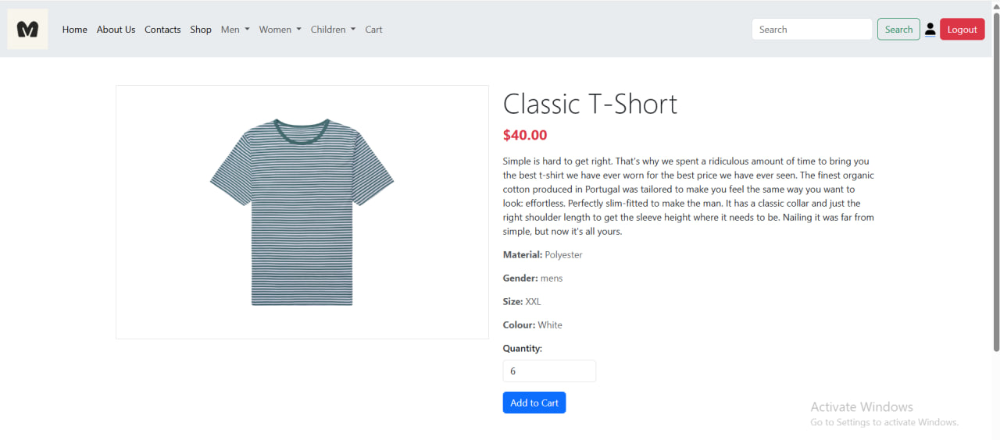
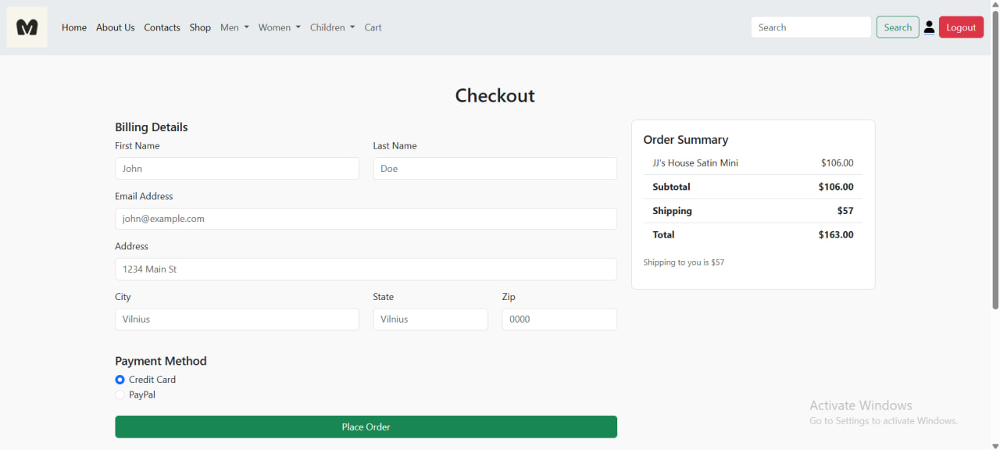
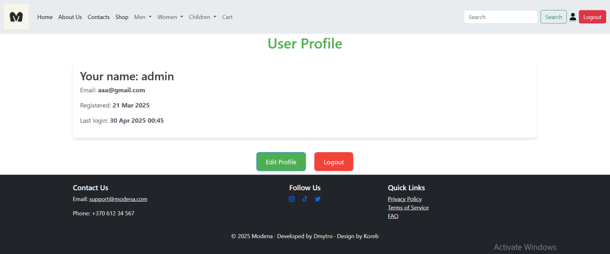

# Modena — Online Clothing Store

Modena is a modern web platform for managing an online clothing store. It features a user-friendly admin panel, multilingual support, and is built with scalability in mind.

## 🚀 Key Features
- **Intuitive admin panel** for managing products.
- **Categories, filters, and search system** for easy navigation.
- **Product display with multiple attributes** (size, color, material, gender, etc.).
- **Related products and collections** to enhance shopping experience.
- **Multiple images per product** for better product representation.
- **Responsive modern UI** for desktop.
- **User registration** and **profile management**.
- **Add products to cart** and modify ordered quantities.
- **Checkout page** for completing purchases

## 🛠️ Technologies Used
- **Python**, **Django** for server-side development.
- **SQLITE3** for data storage.
- **HTML, CSS (Bootstrap 4.5.3)** for front-end design.

## ⚙️ Installation
1. Clone the repository:
    ```bash
    git clone https://github.com/DimaPr7/modena_project
    cd modena
    ```

2. Install the dependencies:
    ```bash
    pip install -r requirements.txt
    ```

3. Create and configure the `.env` file (based on `.env.example`).

4. Apply migrations and run the development server:
    ```bash
    python manage.py migrate
    python manage.py runserver
    ```

5. Open your browser and go to:
    ```
    http://127.0.0.1:8000
    ```

## 📸 Screenshots













© 2025 Modena. All rights reserved.
