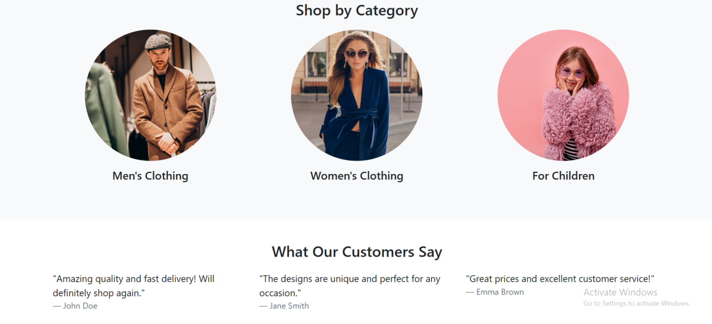
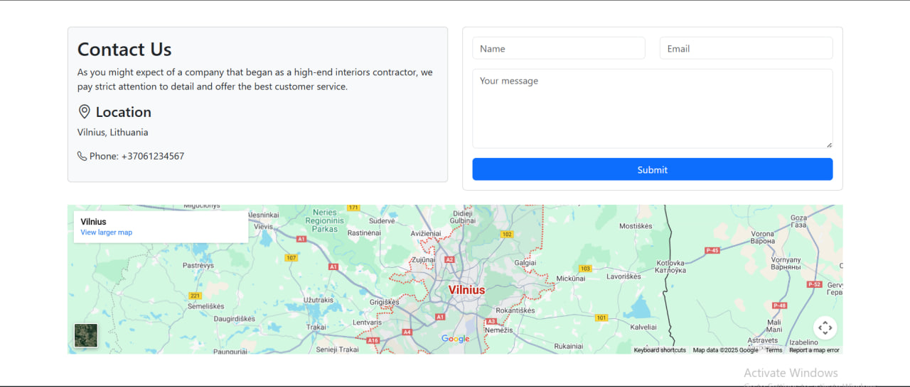
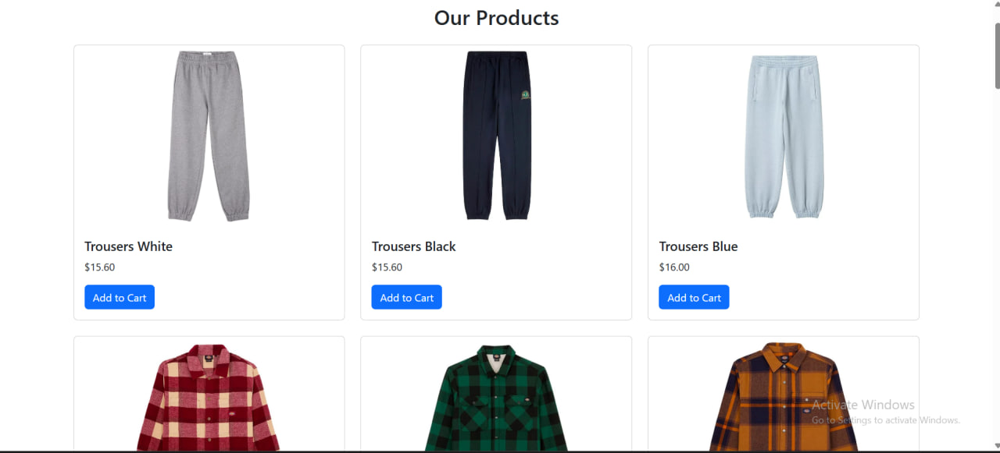
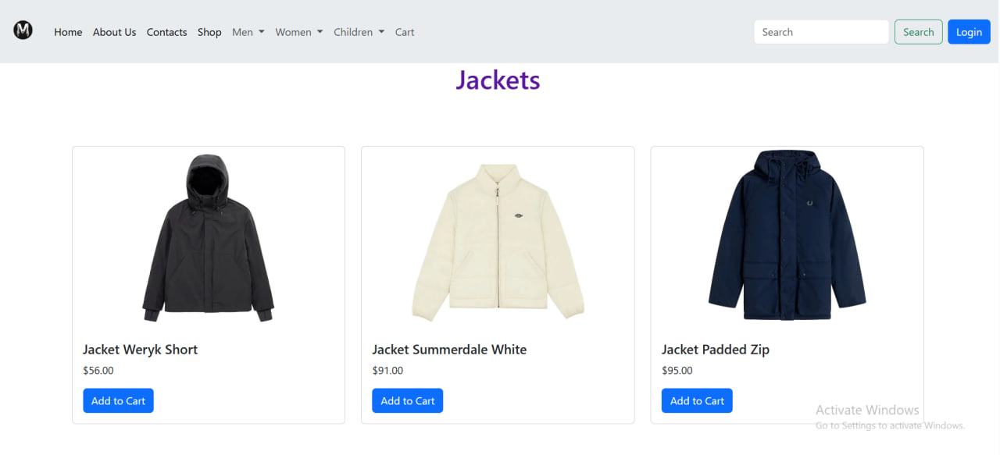
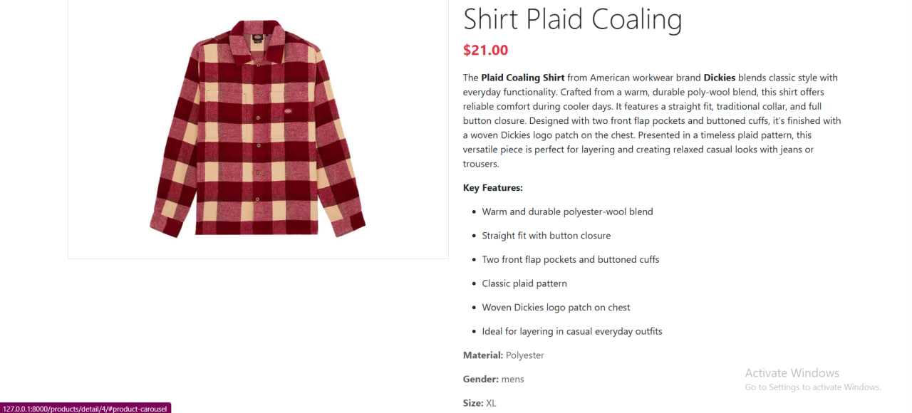
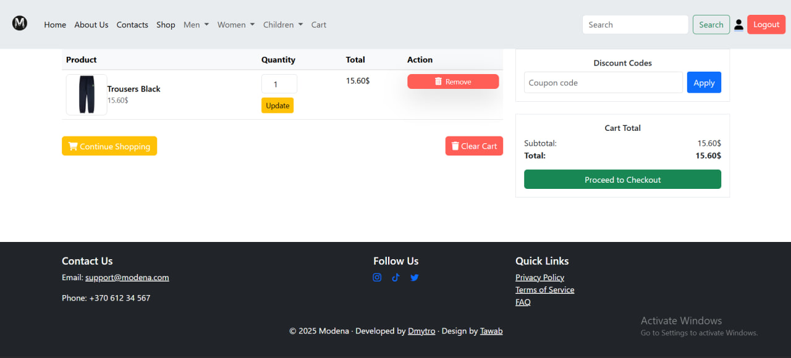
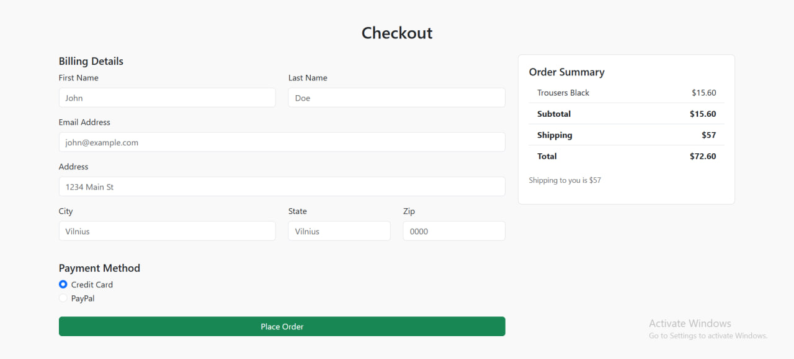
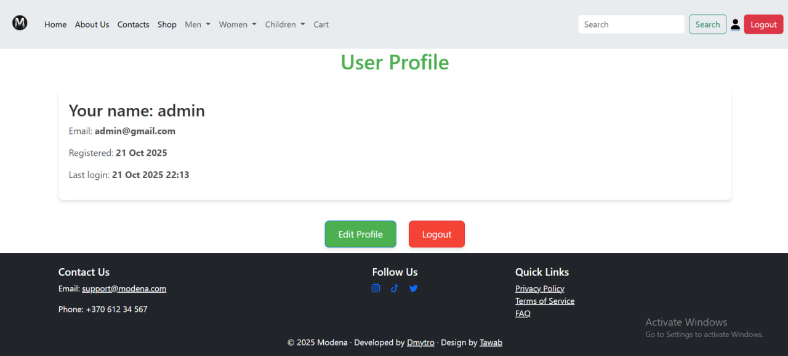

# Modena — Online Clothing Store

Modena is a modern web platform for managing an online clothing store. It features a user-friendly admin panel, multilingual support, and is built with scalability in mind.

## 🚀 Key Features
- **Intuitive admin panel** for managing products.
- **Categories, filters, and search system** for easy navigation.
- **Product display with multiple attributes** (size, color, material, gender, etc.).
- **Related products and collections** to enhance shopping experience.
- **Multiple images per product** for better product representation.
- **Responsive modern UI** for desktop.
- **User login** and **profile management**.
- **Add products to cart** and modify ordered quantities.
- **Checkout page** for completing purchases

## 🛠️ Technologies Used
- **Python**, **Django** for server-side development.
- **SQLITE3** for data storage.
- **HTML, CSS (Bootstrap 4.5.3)** for front-end design.

## 📸 Screenshots

Contact & Links
Email: i.love.python.lt@gmail.com
Live site: https://modena-u9vt.onrender.com

© Modena
Version 1.0
Last updated: October 2025